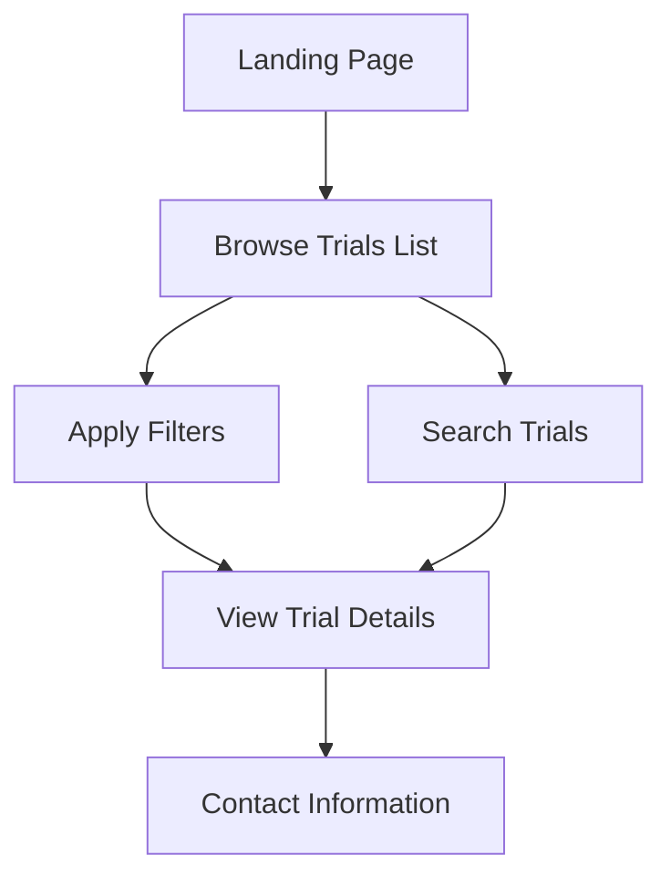
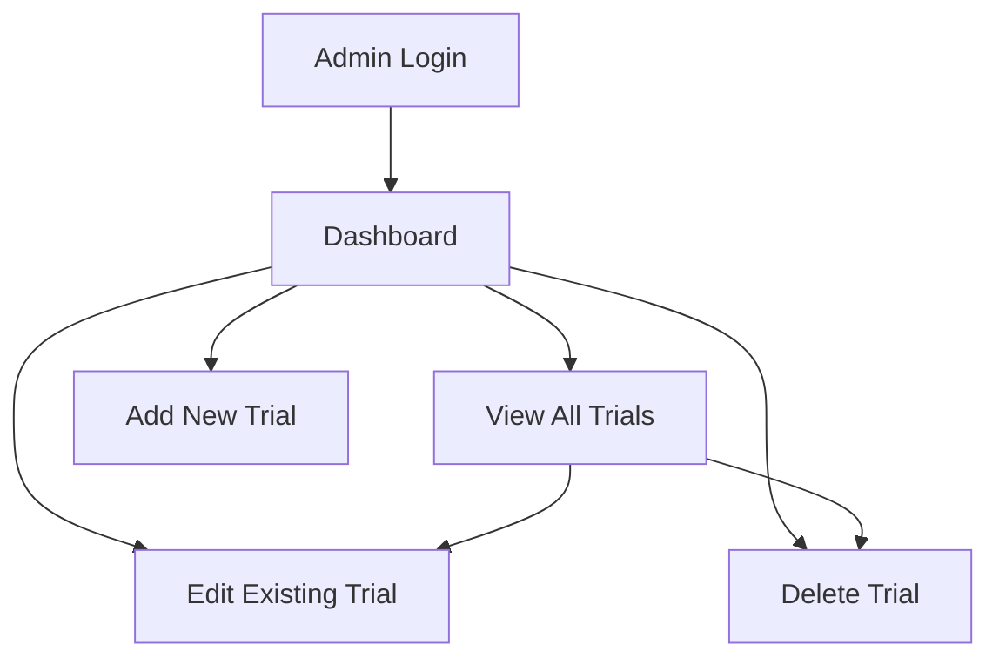
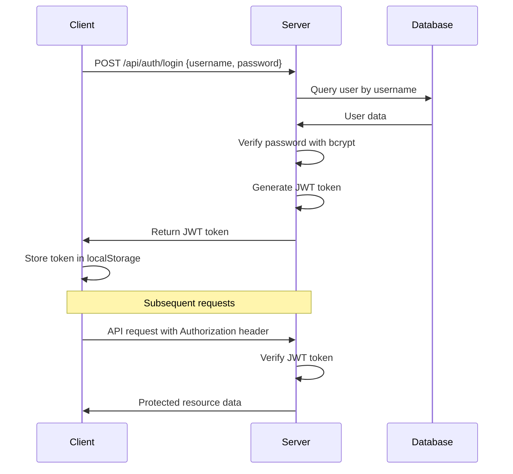
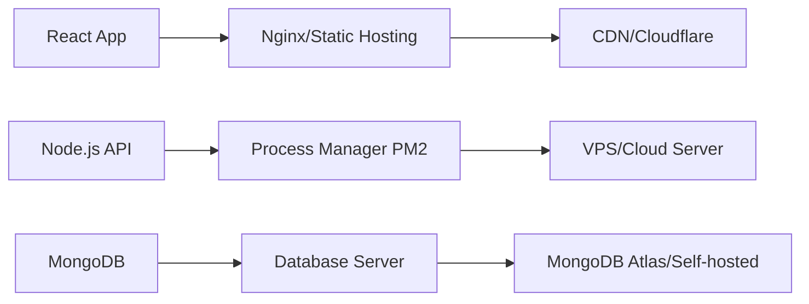

# Clinical Trials Website Architecture

## System Overview

This is a full-stack web application built with React frontend, Node.js/Express backend, and MongoDB database. The system allows public users to browse clinical trials and administrators to manage trial data.

## Technology Stack

- **Frontend**: React 18, React Router, Axios, Material-UI/Tailwind CSS
- **Backend**: Node.js, Express.js, JWT for authentication
- **Database**: MongoDB with Mongoose ODM
- **Authentication**: JWT tokens with bcrypt for password hashing

## Database Schema

### Clinical Trial Model
```javascript
{
  _id: ObjectId,
  title: String (required),
  description: String (required),
  qualification: String (required),
  status: String (enum: ['past', 'ongoing', 'upcoming']),
  location: {
    hospital: String,
    city: String,
    state: String,
    zipCode: String
  },
  contactEmail: String (required),
  startDate: Date,
  endDate: Date,
  estimatedDuration: String,
  eligibilityCriteria: [String],
  primaryObjective: String,
  secondaryObjectives: [String],
  studyType: String,
  phase: String,
  sponsor: String,
  createdAt: Date,
  updatedAt: Date
}
```

### Admin User Model
```javascript
{
  _id: ObjectId,
  username: String (required, unique),
  email: String (required, unique),
  password: String (required, hashed),
  role: String (default: 'admin'),
  createdAt: Date,
  lastLogin: Date
}
```

## API Endpoints

### Public Endpoints
- `GET /api/trials` - Get all trials with filtering and pagination
- `GET /api/trials/:id` - Get specific trial details
- `GET /api/trials/search` - Search trials by keywords

### Admin Endpoints (Protected)
- `POST /api/auth/login` - Admin login
- `POST /api/auth/refresh` - Refresh JWT token
- `POST /api/admin/trials` - Create new trial
- `PUT /api/admin/trials/:id` - Update existing trial
- `DELETE /api/admin/trials/:id` - Delete trial
- `GET /api/admin/trials` - Get all trials with admin metadata

## Frontend Components Structure

```
src/
├── components/
│   ├── common/
│   │   ├── Header.jsx
│   │   ├── Footer.jsx
│   │   ├── LoadingSpinner.jsx
│   │   └── ErrorMessage.jsx
│   ├── trials/
│   │   ├── TrialCard.jsx
│   │   ├── TrialsList.jsx
│   │   ├── TrialDetail.jsx
│   │   ├── TrialFilters.jsx
│   │   └── SearchBar.jsx
│   └── admin/
│       ├── AdminLogin.jsx
│       ├── AdminDashboard.jsx
│       ├── TrialForm.jsx
│       └── ProtectedRoute.jsx
├── pages/
│   ├── HomePage.jsx
│   ├── TrialDetailPage.jsx
│   ├── AdminLoginPage.jsx
│   └── AdminDashboardPage.jsx
├── services/
│   ├── api.js
│   ├── auth.js
│   └── trials.js
├── hooks/
│   ├── useAuth.js
│   ├── useTrials.js
│   └── useLocalStorage.js
├── context/
│   └── AuthContext.jsx
└── utils/
    ├── constants.js
    ├── helpers.js
    └── validation.js
```

## User Flow Diagrams

### Public User Flow


### Admin User Flow


## Authentication Flow


## Sample Data Structure

The system will include 30 sample clinical trials from Southern California hospitals including:
- UCLA Medical Center
- Cedars-Sinai Medical Center
- USC Keck Medicine
- Kaiser Permanente facilities
- Scripps Health System
- Sharp HealthCare
- UC San Diego Health

Sample trial categories:
- Oncology studies
- Cardiovascular research
- Neurology trials
- Diabetes and endocrine studies
- Mental health research
- Pediatric trials
- Vaccine studies

## Security Considerations

1. **Authentication**: JWT tokens with expiration
2. **Password Security**: bcrypt hashing with salt rounds
3. **Input Validation**: Joi/express-validator for request validation
4. **CORS**: Configured for specific origins
5. **Rate Limiting**: Prevent API abuse
6. **Environment Variables**: Sensitive data in .env files

## Deployment Architecture



## Development Workflow

1. **Setup Phase**: Project initialization and dependency installation
2. **Backend Development**: API endpoints and database models
3. **Frontend Development**: React components and routing
4. **Integration**: Connect frontend to backend APIs
5. **Data Population**: Generate and seed sample trial data
6. **Testing**: Unit tests and integration testing
7. **Deployment**: Production setup and configuration

## Key Features Implementation

### Trial Status Management
- Automatic status updates based on dates
- Visual indicators for each status type
- Filtering capabilities by status

### Search and Filter System
- Full-text search across trial titles and descriptions
- Location-based filtering
- Status-based filtering
- Study type and phase filtering

### Admin Panel Features
- CRUD operations for trials
- Bulk operations for managing multiple trials
- Trial analytics and statistics
- Export functionality for trial data

### Responsive Design
- Mobile-first approach
- Tablet and desktop optimizations
- Touch-friendly interfaces
- Progressive Web App capabilities

This architecture provides a scalable, maintainable solution for managing and displaying clinical trial information with proper security measures and user experience considerations.