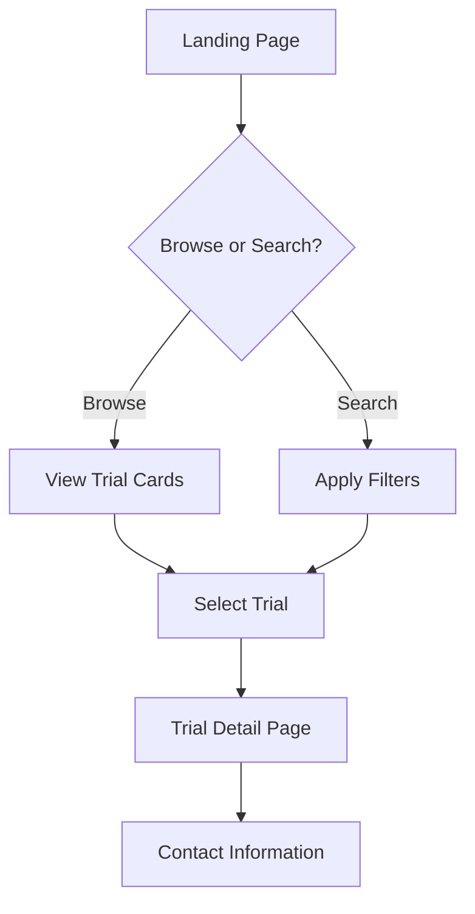
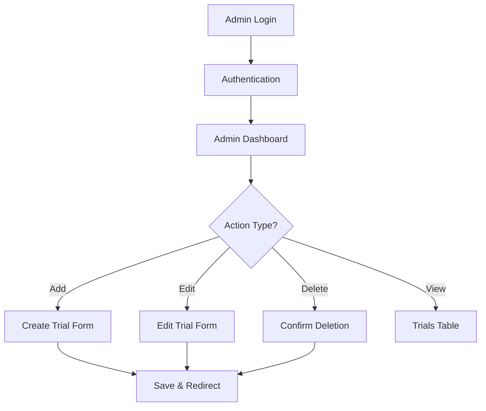

# Clinical Trials Website - Simple Architecture

## System Overview

This is a client-side web application built with vanilla HTML, CSS, and JavaScript. Data is stored in JSON files and managed through browser localStorage for admin authentication. No server setup required - can be run directly from file system or hosted on any static hosting service.

## Technology Stack

- **Frontend**: Vanilla HTML5, CSS3, JavaScript (ES6+)
- **Data Storage**: JSON files for trial data
- **Authentication**: Browser localStorage with simple password protection
- **Styling**: Custom CSS with responsive design principles

## Project Structure

```
clinical-trials-website/
├── index.html                 # Main trials listing page
├── trial-detail.html         # Individual trial details page
├── admin-login.html          # Admin authentication page
├── admin-panel.html          # Admin management interface
├── css/
│   ├── styles.css            # Main stylesheet
│   ├── components.css        # Component-specific styles
│   └── admin.css             # Admin panel styles
├── js/
│   ├── main.js               # Main application logic
│   ├── trial-manager.js      # Trial data management
│   ├── admin.js              # Admin functionality
│   ├── search-filter.js      # Search and filtering logic
│   └── utils.js              # Utility functions
├── data/
│   └── trials.json           # Clinical trials database
├── images/
│   └── [trial images and icons]
└── README.md                 # Setup and usage documentation
```

## Data Structure

### Clinical Trial JSON Schema
```javascript
{
  "trials": [
    {
      "id": "unique-trial-id",
      "title": "Trial Title",
      "description": "Detailed description of the trial",
      "qualification": "Patient qualification criteria",
      "status": "ongoing|past|upcoming",
      "location": {
        "hospital": "Hospital Name",
        "city": "City",
        "state": "CA",
        "zipCode": "90210",
        "address": "Full address"
      },
      "contactEmail": "contact@hospital.com",
      "startDate": "2024-01-15",
      "endDate": "2025-06-30",
      "estimatedDuration": "18 months",
      "eligibilityCriteria": [
        "Age 18-65",
        "Specific medical condition",
        "No prior treatment"
      ],
      "primaryObjective": "Main study goal",
      "secondaryObjectives": ["Secondary goal 1", "Secondary goal 2"],
      "studyType": "Interventional",
      "phase": "Phase II",
      "sponsor": "Research Institution",
      "lastUpdated": "2024-01-10T10:00:00Z"
    }
  ]
}
```

## Page Structure and Functionality

### 1. Main Listing Page (`index.html`)
- **Components**: Header with search bar, filter sidebar, trial cards grid
- **Features**: 
  - Search by title/description/location
  - Filter by status, location, study type
  - Responsive card layout
  - Pagination for large datasets
  - Sort by date, status, location

### 2. Trial Detail Page (`trial-detail.html`)
- **Components**: Trial header, detailed information sections, contact form
- **Features**:
  - Full trial information display
  - Contact email with mailto link
  - Eligibility criteria checklist
  - Timeline visualization
  - Print-friendly layout

### 3. Admin Login Page (`admin-login.html`)
- **Components**: Simple login form
- **Features**:
  - Username/password authentication
  - Session management with localStorage
  - Redirect to admin panel on success

### 4. Admin Panel (`admin-panel.html`)
- **Components**: Trial management interface, forms for CRUD operations
- **Features**:
  - View all trials in table format
  - Add new trial form
  - Edit existing trials
  - Delete trials with confirmation
  - Bulk operations
  - Export data functionality

## JavaScript Architecture

### Core Modules

#### 1. `main.js` - Application Entry Point
```javascript
// Main application initialization
// Event listeners setup
// Page routing logic
// Global state management
```

#### 2. `trial-manager.js` - Data Management
```javascript
class TrialManager {
  async loadTrials()          // Load from JSON file
  searchTrials(query)         // Search functionality
  filterTrials(criteria)      // Filter by various criteria
  getTrialById(id)           // Get specific trial
  addTrial(trialData)        // Add new trial (admin)
  updateTrial(id, data)      // Update existing trial (admin)
  deleteTrial(id)            // Delete trial (admin)
  saveTrials()               // Save changes to JSON file
}
```

#### 3. `admin.js` - Admin Functionality
```javascript
class AdminManager {
  login(username, password)   // Simple authentication
  logout()                   // Clear session
  isAuthenticated()          // Check login status
  createTrialForm()          // Generate trial creation form
  validateTrialData(data)    // Form validation
}
```

#### 4. `search-filter.js` - Search and Filter Logic
```javascript
class SearchFilter {
  applyTextSearch(trials, query)
  applyStatusFilter(trials, status)
  applyLocationFilter(trials, location)
  applyCombinedFilters(trials, criteria)
  sortTrials(trials, sortBy, order)
}
```

## Sample Data - Southern California Hospitals

The system includes 30 sample clinical trials from major SoCal medical institutions:

### Hospital Partners:
- **UCLA Medical Center** (Los Angeles)
- **Cedars-Sinai Medical Center** (Los Angeles)
- **USC Keck Medicine** (Los Angeles)
- **Kaiser Permanente Los Angeles**
- **Scripps Health** (San Diego)
- **Sharp HealthCare** (San Diego)
- **UC San Diego Health**
- **Hoag Memorial Hospital** (Newport Beach)
- **City of Hope** (Duarte)
- **Children's Hospital Los Angeles**

### Trial Categories:
- Oncology (8 trials)
- Cardiovascular (6 trials)
- Neurology (4 trials)
- Diabetes/Endocrine (3 trials)
- Mental Health (3 trials)
- Pediatric (3 trials)
- Vaccine Studies (3 trials)

## Authentication System

### Simple Admin Authentication
```javascript
// Default credentials (can be changed)
const ADMIN_CREDENTIALS = {
  username: "admin",
  password: "clinicaltrials2024"
};

// Session management
localStorage.setItem('adminSession', JSON.stringify({
  authenticated: true,
  loginTime: Date.now(),
  expiresIn: 24 * 60 * 60 * 1000 // 24 hours
}));
```

## Styling Approach

### CSS Framework Strategy
- **No external frameworks** - custom CSS for full control
- **CSS Grid and Flexbox** for responsive layouts
- **CSS Custom Properties** for consistent theming
- **Mobile-first approach** with progressive enhancement

### Design System
```css
:root {
  --primary-color: #2563eb;
  --secondary-color: #64748b;
  --success-color: #10b981;
  --warning-color: #f59e0b;
  --error-color: #ef4444;
  --background-color: #f8fafc;
  --card-background: #ffffff;
  --text-primary: #1e293b;
  --text-secondary: #64748b;
}
```

### Component Styles
- **Trial Cards**: Clean, informative cards with status indicators
- **Forms**: User-friendly with validation feedback
- **Navigation**: Intuitive with breadcrumbs
- **Admin Interface**: Functional, table-based layout

## User Experience Flow

### Public User Journey


### Admin User Journey


## Deployment Options

### Static Hosting Services
1. **GitHub Pages** - Free, version controlled
2. **Netlify** - Free tier with custom domains
3. **Vercel** - Easy deployment with Git integration
4. **Firebase Hosting** - Google's static hosting
5. **Local File System** - Direct browser opening

### Setup Requirements
- No server setup needed
- No database installation required
- Works directly in modern browsers
- Compatible with all operating systems

## Security Considerations

### Client-Side Security
- Admin credentials stored securely
- Session timeout implementation
- Input validation and sanitization
- XSS prevention in data display

### Data Integrity
- JSON schema validation
- Backup mechanisms for data files
- Error handling for corrupted data
- User confirmation for destructive operations

## Performance Features

### Optimization Strategies
- Lazy loading for large datasets
- Efficient search algorithms
- Minimal DOM manipulation
- CSS and JS minification ready
- Image optimization
- Local storage caching

This simplified architecture provides all the requested functionality while maintaining ease of deployment and maintenance. The system can be easily extended with additional features as needed.